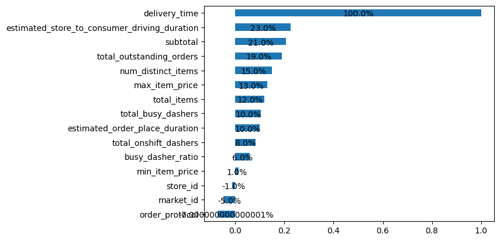
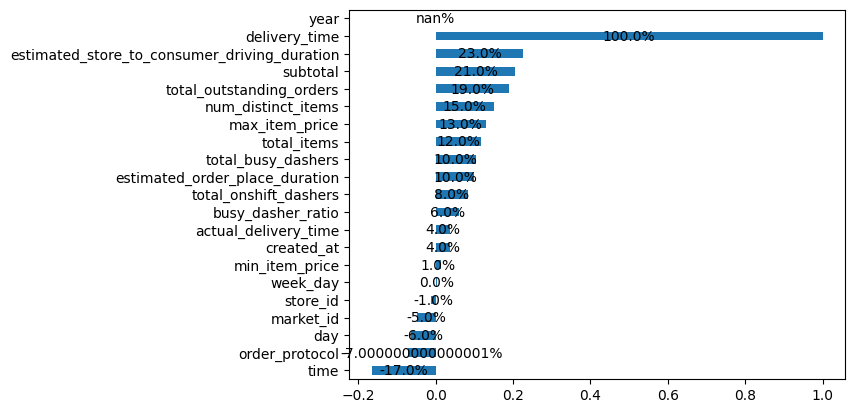

## Data Science Project

### `Project Topic` - Delivery Duration Prediction

### Problem Statement

When a consumer places an order on DoorDash, we show the expected time of delivery. It is very important for DoorDash to get this right, as it has a big impact on consumer experience. In this exercise, we will build a model to predict the `estimated time taken for a delivery`.

Specifically : we will create a model that will predict the total delivery duration in seconds 
i.e. the time taken from 

• Start - the time consumer submits the order to

• End - When the order will be delivered to the consumer 

### `Dataset Description and its Attributes`

The attached file `historical_data.csv` contains a subset of deliveries received at DoorDash in early 2015 in a subset of the cities. Each row in this file corresponds to one unique delivery. 

#### `Note` - 
All Money (dollar) values given in dataset are in cents and all the time duarion values given are in seconds

Each column corresponds to a feature as explained below : 

### Time features 
• `market_id` - A city/region in which DoorDash operates
• `created_at`: when the order was submitted by the consumer to DoorDash
• `actual_delivery_time`: when the order was delivered to the consumer

### Store features

• `store_id`: an id representing the restaurant the order was submitted for 
• `store_primary_category`: cuisine category of the restaurant, e.g., italian, asian
• `order_protocol`: a store can receive orders from DoorDash through many modes. This field represents an id denoting the protocol.

### Order features

• `total_items`: total number of items in the order
• `subtotal`: total value of the order submitted (in cents)
• `num_distinct_items`: number of distinct items included in the order
• `min_item_price`: price of the item with the least cost in the order (in cents)
• `max_item_price`: price of the item with the highest cost in the order (in cents)

### Market features

The following features are values at the time of created_at (order submission time):

• `total_onshift_dashers`: Number of available dashers who are within 10 miles of the store at the time of order creation
• `total_busy_dashers`: Subset of above total_onshift_dashers who are currently working on an order
• `total_outstanding_orders`: Number of orders within 10 miles of this order that are currently being processed.

## In-Depth Project Analysis 

### Data Cleaning 

Prepocessing the data by handling the missing values, removing duplicates and any inconsistency in the dataset

♦ dataset info - we have `197428` entries and `16` columns in our dataset,

♦ We have 3 object types features in dataset. Featuers `created_at` and `actaul_delivery_time` has dates but is of object type, converting both the features to date time format using `pd.to_datetime` so that we can subtract `actaul_delivery_time` - `created_at` to get the actual delivery_time in seconds, and the resulting feature will be our target variable 

`target_variable` = `created_at` - `actaul_delivery_time`

#### Handling Missing Values

we have `1.77 %` percent of missing data in dataset. Handling missing values has never been a straight approach, if there are any patterns in the missing values then its analyst's job to look into them which might lead to interesting and helpful insights in the bussiness, if there aren't any patterns then we can follow the most common approach which will be using mean or median if the data is continious or mode in case of categorical data. If any feature has more than 80% data missing then we could just drop it , as using mode might lead to a imbalanced feature

We have some features with missing values in it, we will be using mean , median or mode if the feature has less than 1% missing values and remaining features will be handled accordingly. 

We have an object column `store_primary_category` with missing values, we will be filling the missing values based on feature `store_id`. `store_primary_category` is `cuisine category of the restuarant`. We will be getting `mode` or `most_frequent` value of the `store_primary_category` for each `store_id` and then we will be mapping those `cuisine_category` to each `store_id`. And we will be droping all nan values as there is no pattern in it.

Now that we have handled missing values , duplicates and cleaned our data, we will performing  statistics based analysis on the dataset

## Exploratory Data Analysis (EDA)

Exploring the data using descriptive statistics and data visualization techniques and other methods to understand its characteristics and relationship

There are two ways to check the `data normality test`\
♦ Analytically\
♦ Graphically

Graphically we use `Histogram` and `QQ Plot` to check the normality of the data distribution\

##### Observations 
1. As we can see no data is normally distributed 
2. Each feature has many outliers 
3. There are certain features which has extreme outliers like - total_items,                  estimated_order_place_duration and delivery_time
4. Target_variable has extreme outlier in it, checking for any pattern in outlier , if not then drop
5. Most of the features are skewed

### Feature Engineering 

Checking Correlation of each feature with respect to target feature

Extracting and creating  `time` `day` `year` features from the `actaul_delivery_time` feature, and checking if any of these three facctors affect the target_variable.

Time has the inverse relation with the target variable which might be usefull, and we drop the day and year

#### Removing redundant features

A redundant feature in a dataset is a feature that does not add any new or unique information to the analysis. In simpler terms, redundant features are those that are highly correlated with other features or have low variance, making them less informative or valuable for predicting the target variable.\
So we will iterate each feature with every other feature to get the redundant features 

we have `total_onshift_dashers` `total_busy_dashers` `total_outstanding_orders` = `0.94` highly correlated with each other, and `subtotal` `max_item_price` `min_item_price` = `0.68` correlated, thus we will be dropping redundant features

#### Data Transformation

As we have seen above most of the features are highly skewed\
performing power transformation on data we stabilize the variance and make the data more normally distributed, which can lead to increased model performance\
we use `Yeo-Johnson Transformation` which can handle both positive and negative values from `sklearn library` 

After performing power transformation now we have data less skewed and more towards normally distributed

